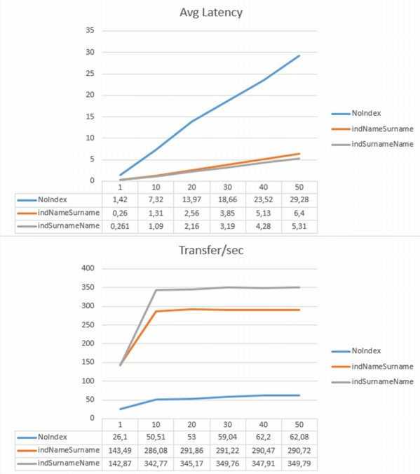
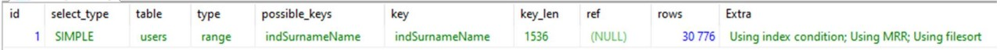

### 1. Графики Latency и Kb/s от кол-ва одновременных запросов, до и после установки индексов.
   
### 2. В случае использования индекса indNameSurname:
   - #### Запрос на добавление индексов:
   ```
   ALTER TABLE `users` ADD INDEX `indNameSurname` (`Name`, `Surname`);
   ```
   - #### Explain запроса:
   ```
   EXPLAIN SELECT
      users.id as id,
      users.name as name,
      users.surname as surname,
      users.birthdate as birthdate,
      users.gender as gender,
      users.city as city
   FROM
      users
   WHERE users.Name LIKE "ан%" AND users.Surname LIKE "ан%"
   ORDER BY id
   ```

### 3. В случае использования индекса indSurnameName:
   - #### Запрос на добавление индексов:
   ```
   ALTER TABLE `users` ADD INDEX `indSurnameName` (`Surname`, `Name`);
   ```
   - #### Explain запроса:
   ```
   EXPLAIN SELECT
      users.id as id,
      users.name as name,
      users.surname as surname,
      users.birthdate as birthdate,
      users.gender as gender,
      users.city as city
   FROM
      users
   WHERE users.Name LIKE "ан%" AND users.Surname LIKE "ан%"
   ORDER BY id
   ```

#### 4. Резюме
Для конечной оптимизации используется составной индекс `('Surname', 'Name')` потому, что в запросе используется объединение AND условий LIKE ?%. Mysql в этом случае ищет по составному индексу и объединяет строки без сортировки. Именно поэтому, приходится принудительно сортировать результаты. Порядок полей выбран с точки зрения селективности. В реальной обстановке поле «Фамилия» все же более селективно чем «Имя». Плюс к этому, мы видим в EXPLAIN запроса, что в случае использования индекса `('Surname', 'Name')` mysql применяет Multi-Range Read оптимизацию, позволяющую линеаризовать процедуру чтения с диска. Возможно за этот счет значительно повысилась скорость передачи данных? по сравнению с индексом `('Name', 'Surname')`. 