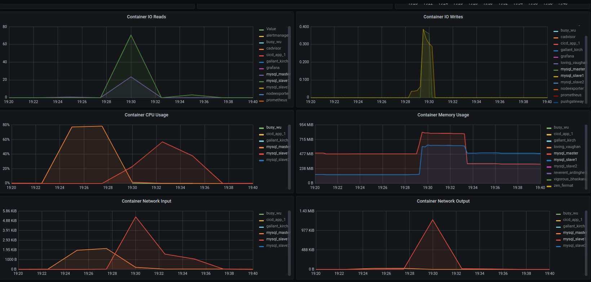

### 1. Настраиваем асинхронную репликацию.
Я решил сделать сразу три хоста - один мастер и два слейва, чтобы к этому не возвращаться в 5-м пункте.
- #### [my.cnf мастера](../../cicd/mysql/mysql_master.conf):
```
[mysqld]
skip-host-cache
skip-name-resolve
server-id = 1
log_bin = /var/log/mysql/mysql-bin.log
binlog_do_db = app
```
- #### [my.cnf первого слэйва](../../cicd/mysql/mysql_slave1.conf):
```
[mysqld]
skip-host-cache
skip-name-resolve
server-id = 2
log_bin = /var/log/mysql/mysql-bin.log
relay-log = /var/log/mysql/mysql-relay-bin.log
binlog_do_db = app
```
- #### [my.cnf первого слэйва](../../cicd/mysql/mysql_slave2.conf):
```
[mysqld]
skip-host-cache
skip-name-resolve
server-id = 3
log_bin = /var/log/mysql/mysql-bin.log
relay-log = /var/log/mysql/mysql-relay-bin.log
binlog_do_db = app
```
- #### [Инициализация кластера](../../cicd/init.sh):
    - на мастере создаем базу, пользователя для работы приложения и пользователя для репликации:
        ```
        CREATE DATABASE IF NOT EXISTS app CHARACTER SET utf8 COLLATE utf8_general_ci;
        GRANT ALL ON app.* TO "app"@"%" IDENTIFIED BY "app";
        GRANT REPLICATION SLAVE ON *.* TO "mydb_slave_user"@"%" IDENTIFIED BY "mydb_slave_pwd";
        FLUSH PRIVILEGES;
        ```
    - на обоих слэйвах создаем базу и пользователя для работы приложения:
        ```
        CREATE DATABASE IF NOT EXISTS app CHARACTER SET utf8 COLLATE utf8_general_ci;
        GRANT ALL ON app.* TO "app"@"%" IDENTIFIED BY "app"; FLUSH PRIVILEGES;
        ``` 
    - определяем текущий IP адрес мастера:
        ```
        docker inspect --format '{{range .NetworkSettings.Networks}}{{.IPAddress}}{{end}}' "mysql_master"
        ```
    - определяем текущий лог файл мастера и позицию в нем:
        ```
        mysql -u root -e "SHOW MASTER STATUS"' | grep mysq | awk '{print $1}'
        mysql -u root -e "SHOW MASTER STATUS"' | grep mysq | awk '{print $2}'
        ```
    - на обоих слейвах назначаем мастера и запускаем репликацию:
        ```
        CHANGE MASTER TO MASTER_HOST={IP_мастера},MASTER_USER='mydb_slave_user',MASTER_PASSWORD='mydb_slave_pwd',MASTER_LOG_FILE={текущий_лог},MASTER_LOG_POS={текущая_позиция};
        START SLAVE;
        ```
### 2. Выбираем 2 любых запроса на чтения (в идеале самых частых и тяжелых по логике работы сайта) и переносим их на чтение со слейва.
Я решил поэкспериментировать с теми же поисковыми запросами, над которыми мы экспериментировали в [ДЗ002](../dz002/REPORT.md). Тем более, что все инструменты для этого уже есть в наличии (wrk).
- #### Добавил в [структуру конфига](../../internal/models/config.go) адреса мастера и двух слейвов:
    ```
    type DSN struct {
        Master	string
        Slave1	string
        Slave2	string
        Port	string
        User	string
        Pass	string
        Base	string
    }
    ```
- #### В [хэндлере страницы app:port/search](../../internal/handlers/handlers.go) создал селектор, который направляет запросы чтения на первый слейв, если он присутствует в конфигурации:
    ```
    db := app.DBMaster
    if app.Config.DSN.Slave1!="" {
        db = app.DBSlave1
    }
    ```

### 3. Делаем нагрузочный тест по странице, которую перевели на слейв до и после репликации. Замеряем нагрузку мастера (CPU, la, disc usage, memory usage).
- #### Разворачиваем prom&grafana в docker настраиваем dashboard grafana на docker контейнеры
    ```
    sudo make prom-up
    ```
- #### Запускаем приложение с подключением только к мастеру и с помощью wrk и [lua скрипта](scripts/post.lua) нагружаем страницу app:port/search:
    ```
    sudo make app-up
    sudo docker run --rm -v /root/scripts:/scripts williamyeh/wrk -t1 -c10 -d5m --timeout 30s http://localhost:8080/search -s /scripts/post.lua -- debug true
    ```
- #### Идем в [графану](http://localhost:3001/) и наблюдаем нагрузку на мастер.
- #### Ждем пока wrk отработает:
    ```
    Running 5m test @ http://192.168.1.66:8080/search
    1 threads and 10 connections
    Thread Stats   Avg      Stdev     Max   +/- Stdev
    Latency     5.83s     1.74s   13.29s    77.58%
    Req/Sec     3.57      4.74    30.00     82.50%
    511 requests in 5.00m, 18.69MB read
    Requests/sec:      1.70
    Transfer/sec:     63.79KB
    ```
- #### Подключаем первый слэйв в приложении, добавлением в docker-compose.yml переменной окружения:
    ```
    APP_DSN_SLAVE1: mysql_slave1
    ```
- #### Перезапускаем контейнер с приложением и нагружаем ту же страницу тем же запросом, с помощью wrk:
    ```
    sudo make app-reload
    sudo docker run --rm -v /root/scripts:/scripts williamyeh/wrk -t1 -c10 -d5m --timeout 30s http://localhost:8080/search -s /scripts/post.lua -- debug true
    ```
- #### Идем в [графану](http://localhost:3001/) и наблюдаем нагрузку на слэйв.
- #### Ждем пока wrk отработает:
    ```
    Running 5m test @ http://192.168.1.66:8080/search
    1 threads and 10 connections
    Thread Stats   Avg      Stdev     Max   +/- Stdev
    Latency    32.12ms   31.59ms 561.62ms   90.65%
    Req/Sec   373.34    147.37   610.00     68.45%
    110834 requests in 5.00m, 433.90MB read
    Non-2xx or 3xx responses: 110834
    Requests/sec:    369.39
    Transfer/sec:      1.45MB
    ```
- #### Получаем график нагрузки:


### 4. ОПЦИОНАЛЬНО: в качестве конфига, который хранит IP реплики сделать массив для легкого добавления реплики. Это не самый правильный способ балансирования нагрузки. Поэтому опционально.
Не очень понял, что именно нужно сделать. Если речь о конфиге приложения, я пока сделал отдельные переменные для каждого сервера БД. Если потребуется, заменю срезом. Пока пусть останется так.
### 5. Настроить 2 слейва и 1 мастер.
Пропускаю этот пункт, т.к. все уже было сделано в п.1
### 6. Включить row-based репликацию.
- #### Добавляем в my.cnf мастера строки:
    ```
    binlog_format=ROW
    binlog-checksum=crc32
    ```
- #### Добавляем в my.cnf обоих слейвов строки:
    ```
    binlog_format=ROW
    binlog-checksum=crc32
    ```
- #### Запускаем кластер и приложение:
    ```
    sudo make app-up
    ```
### 7. Включить GTID.
- #### Добавляем в my.cnf мастера строки:
    ```
    gtid-mode=on
    enforce-gtid-consistency=true
    ```
- #### Добавляем в my.cnf обоих слейвов строки:
    ```
    gtid-mode=on
    enforce-gtid-consistency=true
    ```
- #### Запускаем кластер и приложение:
    ```
    sudo make app-up
    ```
### 8. Настроить полусинхронную репликацию.
- #### Включаем динамическую загрузку модулей и полусинхронную репликацию с таймаутом 1с в my.cnf на мастере:
    ```
    have_dynamic_loading=YES
    rpl_semi_sync_master_enabled=1
    rpl_semi_sync_master_timeout=1000
    ```
- #### Включаем динамическую загрузку модулей и полусинхронную репликацию в my.cnf на обоих слейвах:
    ```
    have_dynamic_loading=YES
    rpl_semi_sync_master_enabled=1
    ```
- #### Устанавливаем semisync плагин на мастере:
    ```
    INSTALL PLUGIN rpl_semi_sync_master SONAME 'semisync_master.so';
    ```
- #### Устанавливаем semisync плагин на обоих слейвах:
    ```
    INSTALL PLUGIN rpl_semi_sync_slave SONAME 'semisync_slave.so';
    ```
- #### Проверяем на всех хостах, установлен ли плагин:
    ```
    SELECT PLUGIN_NAME, PLUGIN_STATUS FROM INFORMATION_SCHEMA.PLUGINS WHERE PLUGIN_NAME LIKE '%semi%';
    ```
- #### Запускаем кластер и приложение:
    ```
    sudo make app-up
    ```
### 9. Создать нагрузку на запись в любую тестовую таблицу. На стороне, которой нагружаем считать, сколько строк мы успешно записали.
### 10. С помощью kill -9 убиваем мастер MySQL.
### 11. Заканчиваем нагрузку на запись.
### 12. Выбираем самый свежий слейв. Промоутим его до мастера. Переключаем на него второй слейв.
### 13. Проверяем, есть ли потери транзакций.


Встроен запуск prometeus, grafana и т.д.
Графана доступна на http://localhost:3001/

$ sudo docker run --rm -v /root/scripts:/scripts williamyeh/wrk -t1 -c10 -d5m --timeout 30s http://192.168.1.66:8080/search -s /scripts/post.lua -- debug true
Running 5m test @ http://192.168.1.66:8080/search
1 threads and 10 connections
Thread Stats   Avg      Stdev     Max   +/- Stdev
Latency     5.83s     1.74s   13.29s    77.58%
Req/Sec     3.57      4.74    30.00     82.50%
511 requests in 5.00m, 18.69MB read
Requests/sec:      1.70
Transfer/sec:     63.79KB

$ sudo make app-reload
...
...
...
$ sudo docker run --rm -v /root/scripts:/scripts williamyeh/wrk -t1 -c10 -d5m --timeout 30s http://192.168.1.66:8080/search -s /scripts/post.lua -- debug true
Running 5m test @ http://192.168.1.66:8080/search
1 threads and 10 connections
Thread Stats   Avg      Stdev     Max   +/- Stdev
Latency    32.12ms   31.59ms 561.62ms   90.65%
Req/Sec   373.34    147.37   610.00     68.45%
110834 requests in 5.00m, 433.90MB read
Non-2xx or 3xx responses: 110834
Requests/sec:    369.39
Transfer/sec:      1.45MB